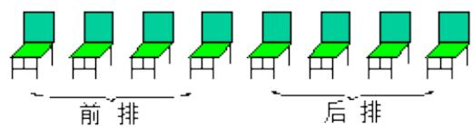
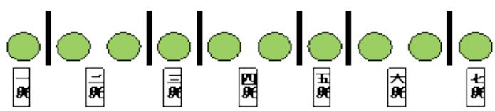

> [!faq]- 《排列组合综合》答案与解析
>
> > [!success]- **【答案】** ##
>
> > [!note]- **【解析】**
> > (1)【问答题】5760
> >
> > 8人排前后两排, 相当于8人坐8把椅子, 可以把椅子排成一排. 个特殊元素有 $A_{4}^{2}$ 种, 再排后4个位置上的特殊元素丙有 $A_{4}^{1}$ 种, 其余的5人在5个位置上任意排列有 $A_{5}^{5}$ 种, 则共有 $A_{4}^{2}A_{4}^{1}A_{5}^{5}=5760$ 种
> >
> > 
> >
> > 一般地，元素分成多排的排列问题，可归结为一排考虑，再分段研究.
> >
> > ##
> > (2)【问答题】84
> >
> > 因为10个名额没有差别，把它们排成一排。相邻名额之间形成9个空隙。在9个空档中选6个位置插个隔板，可把名额分成7份，对应地分给7个班级，每一种插板方法对应一种分法共有 $C_{9}^{6}=84$ 种分法。
> >
> > 
> >
> > (1)【问答题】解析视频请查看最后一题。
> >
> > 【更多习题信息】
> >
> > 难易度：适中
> >
> > 知识点：多排问题，挡板法
> >
> > 【智慧中小学APP扫码查看完整解析】
> >
> > 
