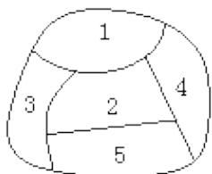

<!-- question-source:start -->
7.【填空题】如图，一个地区分为5个行政区域，现给地图着色，要求相邻区域不得使用同一颜色，现有四种颜色可供选择，则不同的着色方法共有\_\_\_\_种（以数字作答）

<!-- question-source:end -->

![[高中/课堂同步/智慧中小学/选择性必修第三册/第六章 计数原理/6.2.1 排列/排列组合综合/二_填空题/习题/answers/Q00051717A1.md]]
