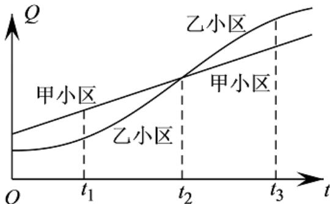

> [!faq]- 《变化率问题1》答案与解析
>
> > [!success]- **【答案】** A
>
> > [!note]- **【解析】**
> > 【更多习题信息】
> > 难易度：简单
> > 知识点：平均变化率
> >
> > 【智慧中小学APP扫码查看完整解析】
> >
> > 
> >
> > 2020年5月1日，北京市开始全面实施垃圾分类，家庭厨余垃圾的分出量不断增加．已知甲、乙两个小区在 $[0,t]$ 这段时间内的家庭厨余垃圾的分出量 $Q$ 与时间 $t$ 的关系如图所示．给出下列四个结论： $①$ 在 $[t_1,t_2]$ 这段时间内，甲小区的平均分出量比乙小区的平均分出量大； $②$ 在 $[t_2,t_3]$ 这段时间内，乙小区的平均分出量比甲小区的平均分出量大； $③$ 在 $t_2$ 时刻，甲小区的分出量比乙小区的分出量增长的慢； $④$ 甲小区在 $[0,t_1],[t_1,t_2],[t_2,t_3]$ 这三段时间中，在 $[t_2,t_3]$ 的平均分出量最大.其中所有正确结论的序号是（）
> >
> > 
> >
> > A. ①②  
> > B. ②③  
> > C. ①④  
> > D. ③④  
> > 【正确答案】B  
> > 【更多习题信息】  
> > 难易度：适中  
> > 知识点：平均变化率  
> > 【智慧中小学APP扫码查看完整解析】
> >
> > 
