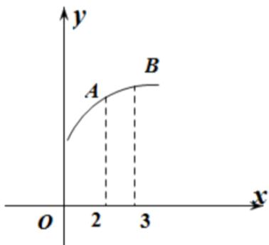

<!-- question-source:start -->
1.【单选题】函数 $f(x)$ 的图象如图所示， $f'(x)$ 为函数 $f(x)$ 的导函数，下列数值排序正确是（）

A. $0 < f'
(2) < f'
(3) < f (3) - f
(2)$

B. $0 < f'
(3) < f (3) - f
(2) < f' (2)$

C. $0 < f
(3) - f
(2) < f'
(3) < f'
(2)$

D. $0 < f
(3) - f
(2) < f' (2) < f
(3)$
<!-- question-source:end -->

![[高中/课堂同步/智慧中小学/选择性必修第二册/第五章 一元函数的导数及其应用/5.1.1 变化率问题/变化率问题2/一_单选题/习题/answers/Q00051734A1.md]]
