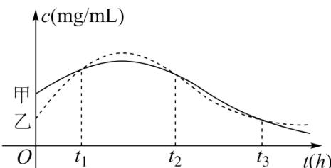

<!-- question-source:start -->
3.【单选题】为评估某种治疗肺炎药物的疗效,有关部门对该药物在人体血管中的药物浓度进行测量。设该药物在人体血管中药物浓度 ${}$ $与时间t$ 的关系为 $c=f(t)$ 。甲、乙两人服用该药物后,血管中药物浓度随时间t变化的关系如下图所示。

给出下列四个结论：
① 在 $t_{1}$ 时刻，甲、乙两人血管中的药物浓度相同；
② 在 $t_{2}$ 时刻，甲、乙血管中药物浓度的瞬时变化率相同；
③ 在 $[t_{2}, t_{3}]$ 这个时间段内，甲、乙两人血管中药物浓度的平均变化率相同；
④ 在 $[t_{1}, t_{2}], [t_{2}, t_{3}]$ 两个时间段内，甲血管中药物浓度的平均变化率相同.

其中所有正确结论的序号是（）
A. ①②
B. ①③④
C. ②③
D. ①③
<!-- question-source:end -->

![[高中/课堂同步/智慧中小学/选择性必修第二册/第五章 一元函数的导数及其应用/5.1.1 变化率问题/变化率问题2/一_单选题/习题/answers/Q00051736A1.md]]
