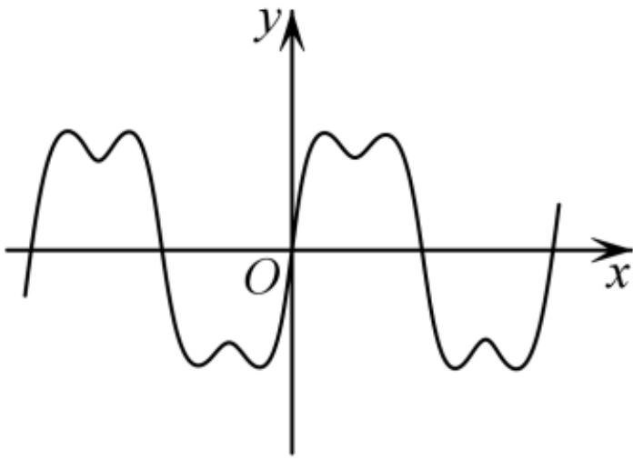
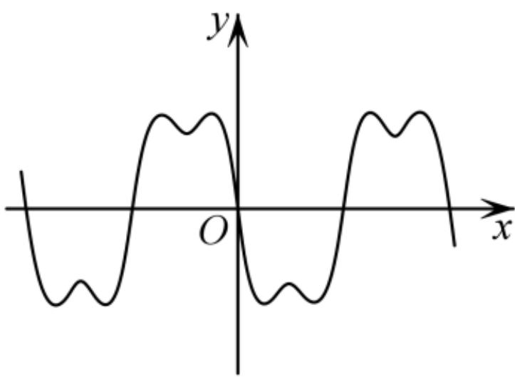
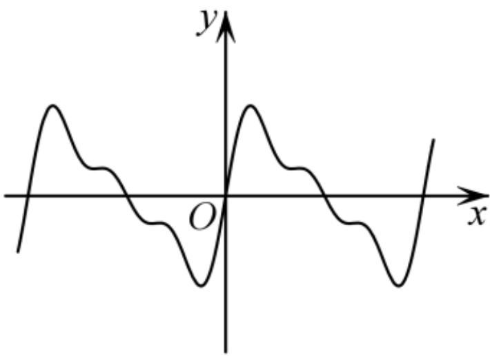
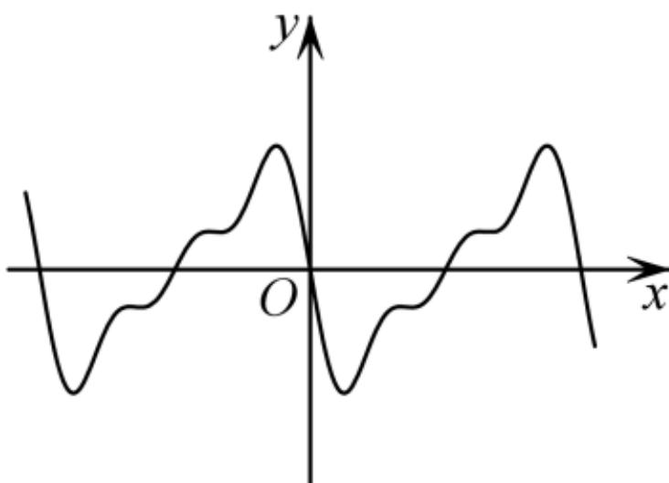

<!-- question-source:start -->
2.【单选题】声音是由物体振动产生的．我们平时听到的声音几乎都是复合音．复合音的产生是由于发音体不仅全段在振动，它的各部分如二分之一、三分之一、四分之一等也同时在振动．不同的振动的混合作用决定了声音的音色，人们以此分辨不同的声音．已知刻画某声音的函数为 $y=\sin x+\frac{1}{2}\sin 2x+\frac{1}{3}\sin 3x$ ，则其部分图象大致为（）

C.  
  
A.

  
B.

<!-- question-source:end -->

![[高中/课堂同步/智慧中小学/选择性必修第二册/第五章 一元函数的导数及其应用/5.3.1 函数的单调性/函数的单调性_1_/一_单选题/习题/answers/Q00051783A1.md]]
