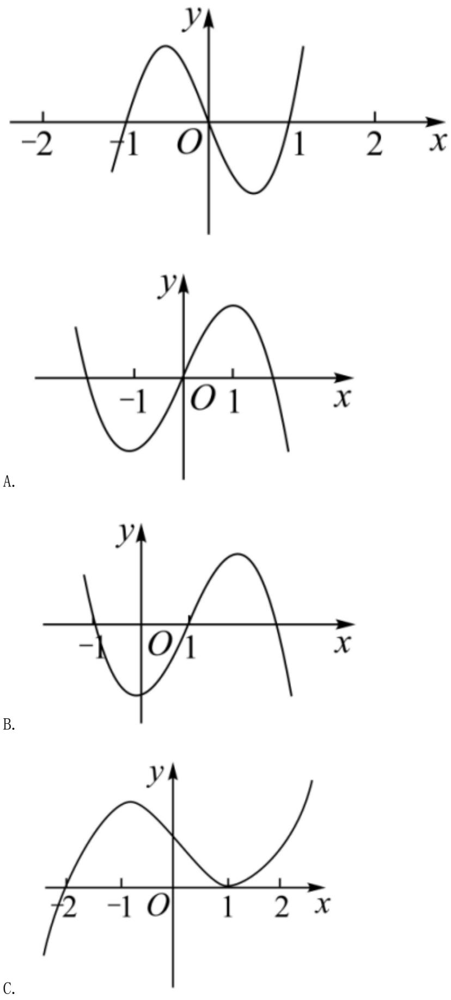
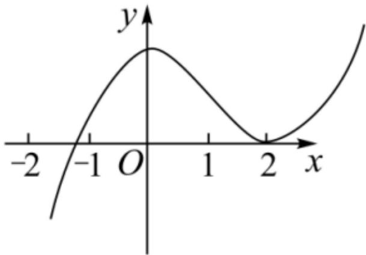

<!-- question-source:start -->
3.【单选题】已知函数 $y = x f'(x)$ 的图象如下图所示，其中 $f'(x)$ 是函数 $f(x)$ 的导函数，函数 $y = f(x)$ 的图象大致是图中的（）

D.
<!-- question-source:end -->

![[高中/课堂同步/智慧中小学/选择性必修第二册/第五章 一元函数的导数及其应用/5.3.1 函数的单调性/函数的单调性_1_/一_单选题/习题/answers/Q00051784A1.md]]
