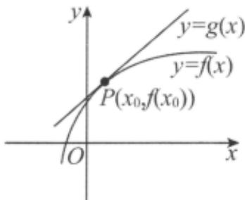

<!-- question-source:start -->
1.【单选题】如图，可导函数 $f(x)$ 在点 $P(x_{0},f(x_{0}))$ 处的切线方程为 $y=g(x)$ ，设 $h(x)=g(x)-f(x)$ ， $h'(x)$ 为 $h(x)$ 的导函数，则下列结论中正确的是（）

A. $h^{\prime}(x_0) = 0$ ， $x_0$ 是 $h(x)$ 的极大值点

B. $h^{\prime}(x_0) = 0$ ， $x_0$ 是 $h(x)$ 的极小值点

C. $h^{\prime}(x_0)\neq 0$ ， $x_0$ 不是 $h(x)$ 的极大值点

D. $h'(x_0) \neq 0$ , $x_0$ 是 $h(x)$ 的极值点
<!-- question-source:end -->

![[高中/课堂同步/智慧中小学/选择性必修第二册/第五章 一元函数的导数及其应用/5.3.2 函数的极值与最大（小）值/函数的极值与最大_小_值_1_/一_单选题/习题/answers/Q00051819A1.md]]
