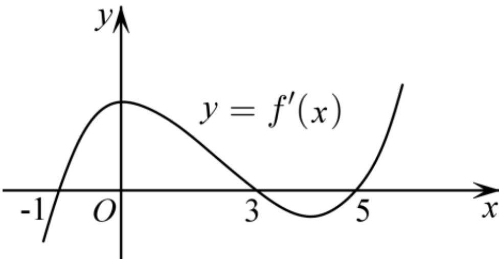

<!-- question-source:start -->
4.【多选题】如图是导函数 $y = f'(x)$ 的图象，则下列说法正确的是（）

A. $(-1, 3)$ 为函数 $y = f(x)$ 的单调递增区间

B. $(0, 5)$ 为函数 $y = f(x)$ 的单调递减区间

C. 函数 $y = f(x)$ 在 $x = 0$ 处取得极大值

D. 函数 $y = f(x)$ 在 $x = 5$ 处取得极小值
<!-- question-source:end -->

![[高中/课堂同步/智慧中小学/选择性必修第二册/第五章 一元函数的导数及其应用/5.3.2 函数的极值与最大（小）值/函数的极值与最大_小_值_1_/二_多选题/习题/answers/Q00051822A1.md]]
