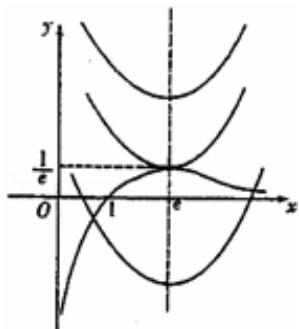
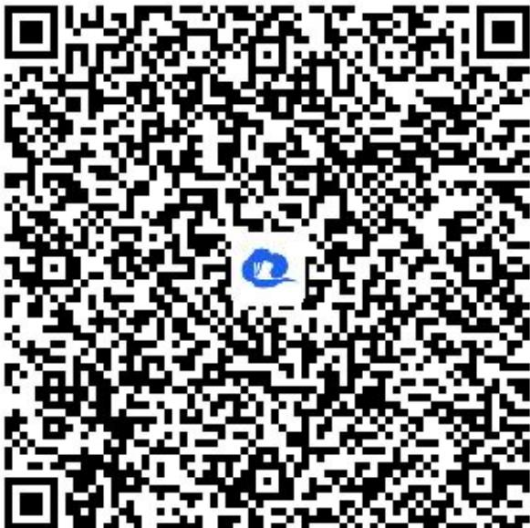

> [!faq]- 《一元函数的导数及其应用小结（1）》答案与解析
>
> > [!success]- **【答案】** （I）由 $g'(x)=\lambda+\cos x$
>
> > [!note]- **【解析】**
> > 又 $\because g(x)$ 在 $[-1, 1]$ 上单调递减，∴ $g'(x) \leqslant 0$ 在 $[-1, 1]$ 上恒成立.
> >
> > $\therefore \lambda \leqslant -\cos x$ 对 $x \in [-1, 1]$ 恒成立， $\because [-\cos x]_{min} = -1 \quad \therefore \lambda \leqslant -1$
> >
> > $\because g(x) \leqslant t^2 + \lambda t + 1$ 在 $x \in [-1, 1]$ 上恒成立，即 $g(x)_{max} \leqslant t^2 + \lambda t + 1$
> >
> > $\because g(x)_{max} = g(-1) = -\lambda - \sin 1$ ， $\therefore -\lambda - \sin 1 \leqslant t^2 + \lambda t + 1$ ，即 $(t + 1)\lambda + t^2 + \sin 1 + 1 \geqslant 0$ 对 $\lambda \leqslant -1$ 恒成立。
> >
> > 令 $F(\lambda) = (t + 1)\lambda + t^2 + \sin 1 + 1 (\lambda \leqslant -1)$ ，则 $\left\{ \begin{array}{l} t + 1 \leqslant 0 \\ -t - 1 + t^2 + \sin 1 + 1 \geqslant 0 \end{array} \right.$ $\therefore \left\{ \begin{array}{l} t \leqslant -1 \\ t^2 - t + \sin 1 \geqslant 0 \end{array} \right., \quad \therefore t \leqslant -1$
> >
> > （Ⅱ）讨论函数 $\mathbf{h}(x)=\frac{\ln x}{x}-x^{2}+2ex-m$ 的零点的个数，即讨论方程 $\frac{\ln x}{x}=x^{2}-2ex+m$ 根的个数．令 $f_{1}(x)=\frac{\ln x}{x},\quad f_{2}(x)=x^{2}-2ex+m,$
> >
> > $\because f_{I}^{\prime}(x) = \frac{I - \ln x}{x^{2}},\quad \therefore$ 当 $x\in (0,e)$ 时， $f_{I}^{\prime}(x) > 0$ ， $\therefore f_I(x)$ 在 $(0,e)$ 上为增函数；
> >
> > 当 $\mathrm{x}\in (e, + \infty)$ 时， $f_{I}^{\prime}(x) <   0$ ， $\therefore f_1(x)$ 在 $(e, + \infty)$ 上为减函数，
> >
> > ∴ 当 x = e 时， $f_{1}(x)_{max} = f_{1}(e) = \frac{l}{e}$ 而 $f_{2}(x) = (x - e)^{2} + m - e^{2}$ ，
> >
> > ∴ 函数 $f_{1}(x)$ 、 $f_{2}(x)$ 在同一坐标系的大致图象如图所示，
> >
> > ∴①当 $m-e^{2}>\frac{l}{e}$ ，即 $m>e^{2}+\frac{l}{e}$ 时，方程无解．函数 $h(x)$ 没有零点；
> > - **②**：当 $m-e^{2}=\frac{1}{e}$ ，即 $m=e^{2}+\frac{1}{e}$ 时，方程有一个根．函数 $h(x)$ 有1个零点
> > - **③**：当 $m-e^{2}<\frac{1}{e}$ ，即 $m<e^{2}+\frac{1}{e}$ 时，方程有两个根．函数 $h(x)$ 有2个零点
> >
> > 
> >
> > 【更多习题信息】
> >
> > 难易度：偏难
> >
> > 知识点：导数与三角
> >
> > 【智慧中小学APP扫码查看完整解析】
> >
> > 
