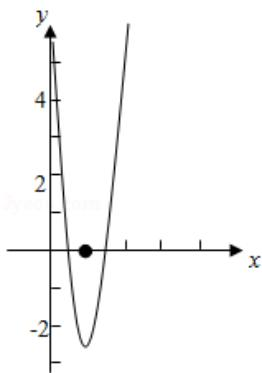

> [!faq]- 《一元函数的导数及其应用小结（1）》答案与解析
>
> > [!success]- **【答案】** 由 $f(x) = (x - 2)e^x + a(x - 1)^2$ ，可得 $f'(x) = (x - 1)e^x + 2a(x - 1) = (x - 1)(e^x + 2a)$ ，
>
> > [!note]- **【解析】**
> > 
> > - **①**：当 a > 0 时， $f(x)$ 在 $(-∞, l)$ 递减；在 $(1, +∞)$ 递增，
> >
> > 且 $f
> > (1) = -e < 0$ ， $x \to +\infty$ ， $f(x) \to +\infty$ ；当 $x \to -\infty$ 时 $f(x) > 0$
> >
> > 或找到一个 x<1 使得 $f(x)>0$ 对于 a>0 恒成立， $f(x)$ 有两个零点；
> > - **②**：当 $a = 0$ 时， $\mathrm{f}(x) = (x - 2)e^x$ ，所以 $f(x)$ 只有一个零点 $x = 2$
> > - **③**：当 a<0 时，若 $a<-\frac{e}{2}$ 时， $f(x)$ 在 $(1,\ln(-2a))$ 递减，在 $(-∞,1)$ ， $(\ln(-2a),+\infty)$ 递增，
> >
> > 又当 $x \leqslant 1$ 时， $f(x) < 0$ ，所以 $f(x)$ 不存在两个零点；
> >
> > 当 $a \geqslant -\frac{e}{2}$ 时，在 $(- \infty, \ln(-2a))$ 单调增，在 $(1, +\infty)$ 单调增，
> >
> > 在 $(\ln(-2a), 1)$ 单调减，只有 $f(\ln(-2a))$ 等于0才有两个零点，
> >
> > 而当 $x \leqslant 1$ 时， $f(x) < 0$ ，所以只有一个零点不符题意.
> >
> > 综上可得， $f(x)$ 有两个零点时，a的取值范围为 $(0, +\infty)$ .
> >
> > 【更多习题信息】
> >
> > 难易度：偏难
> >
> > 知识点：函数零点
> >
> > 【智慧中小学APP扫码查看完整解析】
> >
> > 
