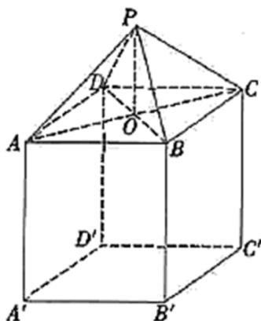

<!-- question-source:start -->
5.【单选题】如图所示，一个仓库设计由上部屋顶和下部主体两部分组成，屋顶的形状是四棱锥 P-ABCD，四边形 ABCD 是正方形，点 O 为正方形 ABCD 的中心， $PO \perp$ 平面 ABCD；下部的形状是长方体 ABCD-A'B'C'D'

. 已知上部屋顶造价与屋顶面积成正比，比例系数为 $k(k > 0)$

，下部主体造价与高度成正比，比例系数为 $8k$ 。若欲造一个上、下总高度为 $10m$ ， $AB = 8m$ 的仓库，则当总造价最低时， $PO = \quad$ （）

A. $\frac{4\sqrt{5}}{5}m$

B. $\frac{4\sqrt{3}}{3}m$

C. 4m

D. $4\sqrt{5}m$
<!-- question-source:end -->

![[高中/课堂同步/智慧中小学/选择性必修第二册/第五章 一元函数的导数及其应用/小结/一元函数的导数及其应用小结_2_/一_单选题/习题/answers/Q00051841A1.md]]
