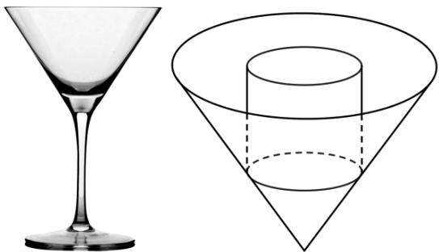

<!-- question-source:start -->
10.【填空题】如图，某款酒杯的容器部分为圆锥，且该圆锥的轴截面为面积是 $16\sqrt{3} \mathrm{~cm}^{2}$ 的正三角形. 若在该酒杯内放置一个圆柱形冰块，要求冰块高度不超过酒杯口高度，则酒杯可放置圆柱形冰块的最大体积为\_\_\_\_.

<!-- question-source:end -->

![[高中/课堂同步/智慧中小学/选择性必修第二册/第五章 一元函数的导数及其应用/小结/一元函数的导数及其应用小结_2_/三_填空题/习题/answers/Q00051846A1.md]]
