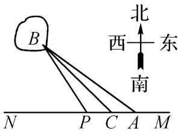

<!-- question-source:start -->
14.【问答题】如图，已知A，B两镇分别位于东西湖岸MN的A处和湖中小岛的B处，点C在A的正西方向1km处， $\tan\angle BAN=\frac{3}{4}$ ， $\angle BCN=\frac{\pi}{4}$ ，.现计划铺设一条电缆连通A，B

两镇，有两种铺设方案：①沿线段AB在水下铺设；②在湖岸MN上选一点P，先沿线段AP 在地下铺设，再沿线段PB

在水下铺设，预算地下、水下的电缆铺设费用分别为2万元/km、4万元/km.

应该如何铺设，使总铺设费用最低？
<!-- question-source:end -->

![[高中/课堂同步/智慧中小学/选择性必修第二册/第五章 一元函数的导数及其应用/小结/一元函数的导数及其应用小结_2_/五_问答题/习题/answers/Q00051850A1.md]]
