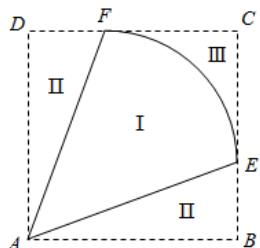

<!-- question-source:start -->
15.【问答题】某地拟规划种植一批芍药，为了美观，将种植区域（区域Ⅰ）设计成半径为1km的扇形 EAF ，中心角 $\angle EAF = \theta\left(\frac{\pi}{4} < \theta < \frac{\pi}{2}\right)$

．为方便观赏，增加收入，在种植区域外围规划观赏区（区域Ⅱ）和休闲区（区域Ⅲ），并将外围区域按如图所示的方案扩建成正方形 ABCD ，其中点 E ， F 分别在边 BC 和 CD

上．已知种植区、观赏区和休闲区每平方千米的年收入分别是10万元、20万元、20万元.

当 $\theta$ 为多少时，年总收入最大？
<!-- question-source:end -->

![[高中/课堂同步/智慧中小学/选择性必修第二册/第五章 一元函数的导数及其应用/小结/一元函数的导数及其应用小结_2_/五_问答题/习题/answers/Q00051851A1.md]]
