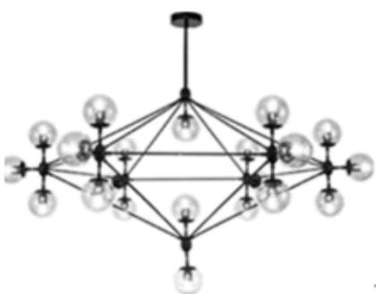
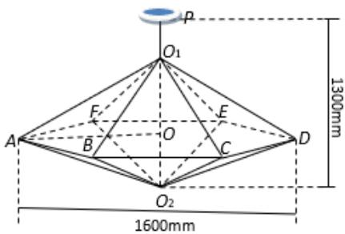

<!-- question-source:start -->
16.【问答题】如图1所示为一种魔豆吊灯，图2为该吊灯的框架结构图，由正六棱锥 $O_{1}$ -ABCDEF 和 $O_{2}$ -ABCDEF 构成，两个棱锥的侧棱长均相等，且棱锥底面外接圆的直径为1600mm，底面中心为O

，通过连接线及吸盘固定在天花板上，使棱锥的底面呈水平状态，下顶点 $O_{2}$ 与天花板的距离为1300mm

，所有的连接线都用特殊的金属条制成，设金属条的总长为 $y$ ：

  
(图 1)  
(图 2)

设 $\angle O_{1}AO = \theta_{(rad)}$ ，当角 $\theta$ 正弦值的大小是多少时，金属条总长 $y$ 最小.
<!-- question-source:end -->

![[高中/课堂同步/智慧中小学/选择性必修第二册/第五章 一元函数的导数及其应用/小结/一元函数的导数及其应用小结_2_/五_问答题/习题/answers/Q00051852A1.md]]
