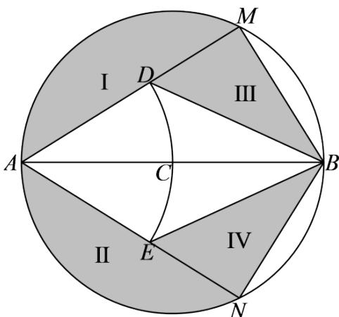

<!-- question-source:start -->
17.【问答题】某温泉度假村拟以泉眼C为圆心建造一个半径为 12

米的圆形温泉池，如图所示， $M$ 、 $N$ 是圆 $C$ 上关于直径 $AB$ 对称的两点，以 $A$ 为圆心， $AC$ 为半径的圆与圆 $\mathbf{C}$ 的弦 $AM$ 、 $AN$ 分别交于点 $D$ 、 $E$ ，其中四边形 $AEBD$ 为温泉区，I、II区域为池外休息区，III、IV区域为池内休息区，设 $\angle MAB = \theta$

当池内休息区的总面积最大时，求 AM 的长.
<!-- question-source:end -->

![[高中/课堂同步/智慧中小学/选择性必修第二册/第五章 一元函数的导数及其应用/小结/一元函数的导数及其应用小结_2_/五_问答题/习题/answers/Q00051853A1.md]]
