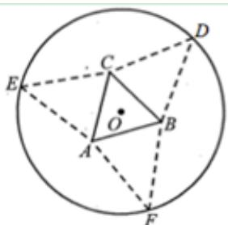
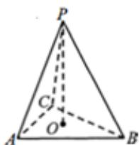

<!-- question-source:start -->
12.【复合题】如图，要利用一半径为 $5 \mathrm{~cm}$

的圆形纸片制作三棱锥形包装盒. 已知该纸片的圆心为 O，先以 O 为中心作边长为 2x （单位：cm）的等边三角形 ABC，再分别在圆 O 上取三个点 D，E，F，使 $\triangle DBC$ ， $\triangle ECA$ ， $\triangle FAB$ 分别是以 BC，CA，AB

为底边的等腰三角形. 沿虚线剪开后，分别以 BC，CA，AB 为折痕折起 $\triangle DBC$ ， $\triangle ECA$ ， $\triangle FAB$ ，使得 D，E，F 重合于点 P，即可得到正三棱锥 P-ABC。

(1)【问答题】若三棱锥 P - ABC 是正四面体，求 x 的值；

(2)【问答题】求三棱锥 P-ABC 的体积 V 的最大值，并指出相应 x 的值.
<!-- question-source:end -->

![[高中/课堂同步/智慧中小学/选择性必修第二册/第五章 一元函数的导数及其应用/小结/一元函数的导数及其应用小结_2_/四_复合题/习题/answers/Q00051848A1.md]]
