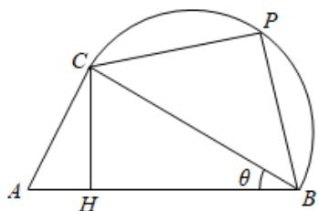

<!-- question-source:start -->
13.【复合题】如图，某校打算在长为1千米的主干道 AB

一侧的一片区域内临时搭建一个强基计划高校咨询和宣传台，该区域由直角三角形区域 $ACB$ （ $\angle ACB$ 为直角）和以 $BC$ 为直径的半圆形区域组成，点 $P$ （异于 $B$ ， $C$ ）为半圆弧上一点，点 $H$ 在线段 $AB$ 上，且满足 $CH \perp AB$ .已知 $\angle PB_{A} = 60^{\circ}$ ，设$\angle ABC = \theta$ ，且 $\theta \in \left[\frac{\pi}{18}, \frac{\pi}{3}\right)$ 。初步设想把咨询台安排在线段 $CH$ ， $CP$

上，把宣传海报悬挂在弧 CP 和线段 CH 上.

(1)【问答题】若为了让学生获得更多的咨询机会，让更多的省内高校参展，打算让 $CH + CP$ 最大，求该最大值；

(2)【问答题】若为了让学生了解更多的省外高校，贴出更多高校的海报，打算让弧CP和线段CH的长度之和最大，求此时的 $\theta$ 的值.
<!-- question-source:end -->

![[高中/课堂同步/智慧中小学/选择性必修第二册/第五章 一元函数的导数及其应用/小结/一元函数的导数及其应用小结_2_/四_复合题/习题/answers/Q00051849A1.md]]
