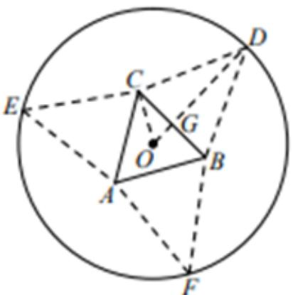
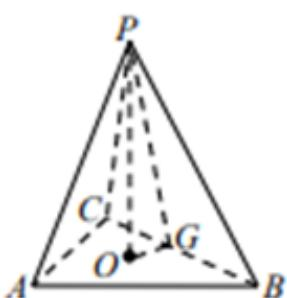

> [!faq]- 《一元函数的导数及其应用小结（2）》答案与解析
>
> > [!success]- **【答案】** (1)
>
> > [!note]- **【解析】**
> > 连结 OD，交 BC 于点 G，连结 OC，
> >
> > 在 $\triangle GOC$ 中， $GC = x$ ， $GO = \frac{x}{\sqrt{3}}$ ，
> >
> > 则 $GD = 5 - \frac{x}{\sqrt{3}}$
> >
> > 因为三棱锥 P - ABC 是正四面体，
> >
> > 所以 $\triangle DBC$ 是正三角形，
> >
> > 所以 $GD = \sqrt{3} GC$ ，即 $5 - \frac{x}{\sqrt{3}} = \sqrt{3} x$ ，解得 $x = \frac{5\sqrt{3}}{4} (cm)$
> >
> > 
> >
> > 
> >
> > (2)【问答题】最大值为 $4\sqrt{15}(cm^{3})$ ，此时 $x=2\sqrt{3}(cm)$ .
> >
> > 在 $\triangle GOP$ 中， $GO = \frac{x}{\sqrt{3}}$ ， $GP = 5 - \frac{x}{\sqrt{3}}$
> >
> > 所以高 $PO = \sqrt{Gp^2 - GO^2} = \sqrt{\left(5 - \frac{x}{\sqrt{3}}\right)^2 - \left(\frac{x}{\sqrt{3}}\right)^2} = \sqrt{25 - \frac{10x}{\sqrt{3}}}.$
> >
> > 由 $25 - \frac{10x}{\sqrt{3}} > 0$ 可得， $x < \frac{5\sqrt{3}}{2}$
> >
> > 所以三棱锥 $P - ABC$ 的体积 $V = \frac{1}{3} S_{\triangle ABC} \cdot PO = \frac{1}{3}\sqrt{3} x^2 \cdot \sqrt{25 - \frac{10x}{\sqrt{3}}} = \frac{\sqrt{15}}{3}\sqrt{5x^4 - \frac{2}{\sqrt{3}}x^5}$ .
> >
> > 设函数 $f(x) = 5x^{4} - \frac{2}{\sqrt{3}} x^{5}$ ， $0 <   x <   \frac{5\sqrt{3}}{2}$
> >
> > 则 $f^{\prime}(x) = 20x^{3} - \frac{10}{\sqrt{3}} x^{4} = 10x^{3}\left(2 - \frac{x}{\sqrt{3}}\right)$
> >
> > 令 $f^{\prime}(x) = 0$ 得， $x = 2\sqrt{3}$ .列表如下：
> >
> > <table><tr><td>x $f'(x)$ </td><td> $(0,2\sqrt{3})$ +</td><td> $2\sqrt{3}$ 0</td><td> $\left(2\sqrt{3},\frac{5\sqrt{3}}{2}\right)$ -</td></tr><tr><td> $f(x)$ </td><td>↗</td><td>极大值</td><td>↘</td></tr></table>
> >
> > 所以 $f(x)$ 在 $x = 2\sqrt{3}$ 时取最大值 $f(2\sqrt{3}) = 144$ ，
> >
> > 所以 $V_{max} = 4\sqrt{15}$
> >
> > 所以 $[f(x)]_{max} = f(2\sqrt{3}) = 144$ ，所以 $V_{max} = 4\sqrt{15}$
> >
> > 所以三棱锥 $P - ABC$ 体积 $V$ 的最大值为 $4\sqrt{15} (cm^3)$ ，此时 $x = 2\sqrt{3}(cm)$ 。
> >
> > 【提示】
> >
> > (1)【问答题】解析视频请查看最后一题。
> >
> > 【更多习题信息】
> >
> > 难易度：偏难
> >
> > 知识点：三棱锥体积
> >
> > 【智慧中小学APP扫码查看完整解析】
> >
> > 
