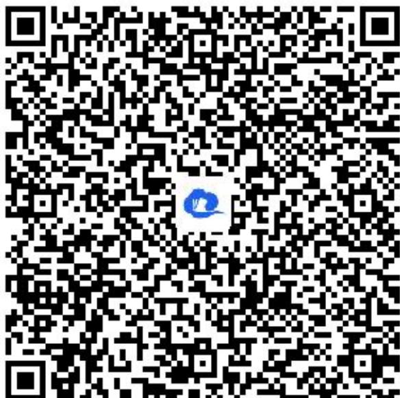

> [!faq]- 《一元函数的导数及其应用小结（2）》答案与解析
>
> > [!success]- **【答案】** (1)
>
> > [!note]- **【解析】**
> > 由题意，在 $Rt \triangle ACB$ 中，可得 $BC = 1 \times \cos\theta = \cos\theta$ ，
> >
> > 在 $Rt\triangle CBH$ 中，可得 $CH = \cos \theta \times \sin \theta = \sin \theta \cos \theta$ ，
> >
> > 在 $Rt\triangle CBP$ 中，可得 $CP = \cos \theta \sin \left(\frac{\pi}{3} -\theta\right)$
> >
> > $$
> > C H + C P = \sin \theta \cos \theta + \cos \theta \sin \left(\frac {\pi}{3} - \theta\right) = \sin \theta \cos \theta + \cos \theta \left(\frac {\sqrt {3}}{2} \cos \theta - \frac {1}{2} \sin \theta\right)
> > $$
> >
> > $$
> > = \frac {1}{2} \sin \theta \cos \theta + \frac {\sqrt {3}}{2} \cos^ {2} \theta = \frac {1}{4} \sin 2 \theta + \frac {\sqrt {3}}{2} \times \frac {1 + \cos 2 \theta}{2} = \frac {1}{2} \sin \left(2 \theta + \frac {\pi}{3}\right) + \frac {\sqrt {3}}{4}
> > $$
> >
> > 因为 $\theta \in \left[\frac{\pi}{18},\frac{\pi}{3}\right)$ ，则 $\frac{4\pi}{9} \leqslant 2\theta + \frac{\pi}{3} < \pi$
> >
> > 所以当且仅当 $2\theta + \frac{\pi}{3} = \frac{\pi}{2}$ ，即 $\theta = \frac{\pi}{12}$ 时， $CH + CP$ 取得最大值，且最大值为 $\frac{2 + \sqrt{3}}{4}$ 千米.
> >
> > (2)【问答题】 $\theta = \frac{\pi}{18}$
> >
> > 取线段 $BC$ 的中点 $O$ ，连接 $OP$ ，则 $\angle COP = 2\angle CBP = 2\left(\frac{\pi}{3} -\theta\right) = \frac{2\pi}{3} -2\theta$
> >
> > 由
> > （1）知， $CO=\frac{1}{2}BC=\frac{1}{2}\cos\theta$ ， $CH=\sin\theta\cos\theta$
> >
> > 故 $\overline{CP}$ 的长为 $\frac{1}{2}\cos\theta\cdot\left(\frac{2\pi}{3}-2\theta\right)=\frac{\pi}{3}\cos\theta-\theta\cos\theta$ ，
> >
> > 则 $CP$ 和线段 $CH$ 的长度之和
> >
> > $y = \frac{\pi}{3} \cos \theta - \theta \cos \theta + \sin \theta \cos \theta = \cos \theta \left( \frac{\pi}{3} - \theta + \sin \theta \right) \, , \quad \theta \in \left[ \frac{\pi}{18}, \frac{\pi}{3} \right) \, .$
> >
> > 设 $f(\theta) = \frac{\pi}{3} -\theta +\sin \theta$ ， $\theta \in \left[\frac{\pi}{18},\frac{\pi}{3}\right)$ ， $g(\theta) = \cos \theta$ ， $\theta \in \left[\frac{\pi}{18},\frac{\pi}{3}\right)$ 则 $y = f(\theta)g(\theta)$
> >
> > 因为 $f'(\theta) = -1 + \cos\theta$ ， $\theta \in \left[\frac{\pi}{18}, \frac{\pi}{3}\right)$ ，所以 $f'(\theta) = -1 + \cos\theta < 0$ ，
> > 故函数 $f(\theta)$ 在区间 $\left[\frac{\pi}{18}, \frac{\pi}{3}\right)$ 上单调递减，故 $f(\frac{\sqrt{3}}{2}) < f(\theta) \leqslant f\left(\frac{\pi}{18}\right)$ .
> > 易知函数 $g(\theta)$ 在区间 $\left[\frac{\pi}{18}, \frac{\pi}{3}\right)$ 上也单调递减，所以 $\frac{I}{2} < g(\theta) \leqslant g\left(\frac{\pi}{18}\right)$ ，
> > 所以 $f(\theta)g(\theta)\leqslant f\left(\frac{\pi}{18}\right)\cdot g\left(\frac{\pi}{18}\right)$ 所以当且仅当 $\theta=\frac{\pi}{18}$ 时，CP 和线段 CH 的长度之和最大.
> >
> > 【提示】
> >
> > (1)【问答题】解析视频请查看最后一题。
> >
> > 【更多习题信息】
> >
> > 难易度：适中
> >
> > 知识点：导数在生活中应用
> >
> > 【智慧中小学APP扫码查看完整解析】
> >
> > 
