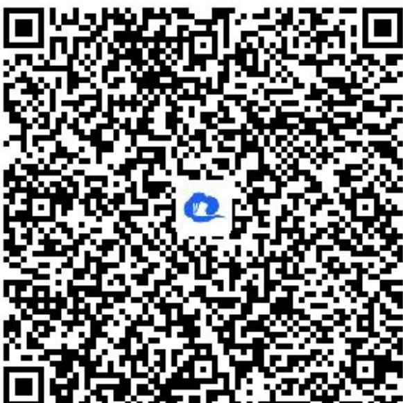

> [!faq]- 《导数在研究函数中的应用小结（2）》答案与解析
>
> > [!success]- **【答案】** 详见解析
>
> > [!note]- **【解析】**
> > 【正确答案】法一： $\forall x\in (0, + \infty)$ ，由 $f(x)\leq 2x - \frac{\ln x}{e^x}$ 可得 $a\leq e^{x} - \frac{\ln x + 1}{x}$ ，其中 $x > 0$
> >
> > 令 \( g(x) = e^{x} - \frac{\ln x + 1}{x} \)，则 \( \{} \) g\left(x\right)=\frac{x{e}}{\hat{x}}-\mathrm{ln}x- \)
> >
> > 1} {x} = \frac { {e} }^{ {x+ \mathit {ln} x} - \mathrm {ln} x-1} {x} \ge \frac {x+ \mathrm {ln} x+1- \mathrm {ln} x-1} {x} = 1 {} \$
> >
> > 当且仅当 $x + \ln x = 0$ 取等号，∴ $a \leq 1$ .
> >
> > 法二： $\forall x\in(0,+\infty)$ ，由 $f(x)\leq2x-\frac{\ln x}{e^{x}}$ 可得 $a\leq e^{x}-\frac{\ln x+1}{x}$ ，其中x>0，
> > 令 $g(x)=e^{x}-\frac{\ln x+1}{x}$ ，其中 x>0，则 $g'(x)=e^{x}+\frac{\ln x}{x^{2}}=\frac{x^{2}e^{x}+\ln x}{x^{2}}$ 令 $h(x)=x^{2}e^{x}+\ln x$ ，其中 x>0，则 $h'(x)=(x^{2}+2x)e^{x}+\frac{1}{x}>0$
> >
> > 故函数 $h(x) = x^{2}e^{x} + \ln x$ 在 $(0, +\infty)$ 上为增函数，
> >
> > 因为 $h\left(\frac{1}{2}\right) = \frac{\sqrt{\mathrm{e}}}{4} - ln2 < 0$ ， $h
> > (1) > 0$
> >
> > 所以，存在 $x_0 \in \left(\frac{l}{2}, l\right)$ 使得 $h(x_0) = x_0^2 e^{x_0} + \ln x_0 = 0$
> >
> > 则 $x_0 e^{x_0} = -\frac{1}{x_0} \ln x_0 = \frac{1}{x_0} \ln \frac{1}{x_0} = e^{\ln \frac{1}{x_0}} \ln \frac{1}{x_0}$
> >
> > 令 $p(x) = x e^{x}$ ，其中 $x > 0$ ，则 $p'(x) = (x + 1)e^{x} > 0$ ，故函数 $p(x)$ 在 $(0, +\infty)$ 上为增函数，
> >
> > 因为 $p(x_{0})=p\left(\ln\frac{1}{x_{0}}\right)$ ，所以， $x_{0}=-\ln x_{0}$ ，可得 $x_{0}+\ln x_{0}=\ln(x_{0}e^{x_{0}})=0$ ，则 $x_{0}e^{x_{0}}=1$ ，
> > 当 $0 < x < x_{0}$ 时， $g'(x) < 0$ ，此时函数 $g(x)$ 单调递减，
> >
> > 当 $x > x_0$ 时， $g'(x) > 0$ ，此时函数 $g(x)$ 单调递增，
> >
> > 所以， $g(x)_{min} = g(x_0) = \frac{x_0e^{x_0} - \ln x_0 - 1}{x_0} = \frac{1 + x_0 - 1}{x_0} = 1$ ， $\therefore a\leq 1.$
> >
> > 【更多习题信息】
> >
> > 难易度：偏难
> >
> > 知识点：利用导数研究不等式的恒成立问题
> >
> > 【智慧中小学APP扫码查看完整解析】
> >
> > 
