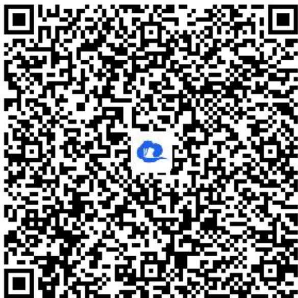

> [!faq]- 《导数在研究函数中的应用小结（2）》答案与解析
>
> > [!success]- **【答案】** 详见解析
>
> > [!note]- **【解析】**
> > 证明： $g(x)$ 无零点.
> > 【正确答案】
> >
> > (1)【问答题】由题意，函数 $f(x) = \ln x + \frac{a}{x}$ ，可得 $f'(x) = \frac{1}{x} - \frac{a}{x^2} = \frac{x - a}{x^2}$ ，
> >
> > 当 $a \leq 0$ 时，则 $f'(x) > 0$ ， $f(x)$ 在 $(0, +\infty)$ 上单调递增，没有极值，不符合题意；
> >
> > 当 $a > 0$ 时，当 $x \in (0, a)$ 时， $f'(x) < 0$ ， $f(x)$ 单调递减；
> >
> > 当 $x \in (a, +\infty)$ 时， $f'(x) > 0$ ， $f(x)$ 单调递增，
> >
> > 所以 $x = a$ 为 $f(x)$ 的极小值点，故 $f(a) = \ln a + 1 = 0$ ，解得 $a = \frac{l}{e}$ .
> >
> > (2)【问答题】法一：
> > 证明：由题意，函数 $g(x)=\left(1-\frac{1}{x}\right)(1+\ln x)+\frac{1}{e^{x}}$ ，且 $g (2)>0$ ，
> > 要证 $g(x)$ 无零点，只需证明 $g(x)>0$ ，只需证 $(x-1)(1+\ln x)+\frac{x}{e^{x}}>0$ ，
> >
> > 即证 $x\ln x + x - \ln x - 1 + \frac{x}{e^x} >0$
> >
> > 由
> > （1）可知， $\ln x + \frac{1}{ex} \geq 0$ ，则 $x \ln x \geq -\frac{1}{e}$ ，当且仅当 $x = \frac{1}{e}$ 时，等号成立，
> >
> > 所以 $x\ln x + x - \ln x - 1 + \frac{x}{e^x}\geq -\frac{1}{e} +x - \ln x - 1 + \frac{x}{e^x}$
> >
> > 构造函数 $h(x) = \frac{x}{e^x} - \ln x + x - 1 - \frac{l}{e}$ ，则 $h'(x) = \frac{(x - 1)(e^x - x)}{xe^x}$ ，
> >
> > 设 $\varphi(x)=e^{x}-x,\quad x>0$ ，可得 $\varphi^{\prime}(x)=e^{x}-1>0$ ， $\varphi(x)$ 单调递增，
> >
> > 所以 $\varphi (x) > \varphi (0) = 1 > 0$ ，所以 $e^x -x > 0$
> >
> > 当 $x \in (0, 1)$ 时， $h'(x) < 0$ ， $h(x)$ 单调递减；
> >
> > 当 $x \in (1, +\infty)$ 时， $h'(x) > 0$ ， $h(x)$ 单调递增，
> >
> > 故 $h(x)\geq h
> > (1) = 0$ ，当且仅当 $x = 1$ 时，等号成立，
> >
> > 因为等号成立的条件不相同，所以 $x \ln x + x - \ln x - 1 + \frac{x}{e^{x}} > 0$ ，故 $g(x)$ 无零点.
> >
> > 法二：
> > 证明：由题意，函数 $g(x) = \left(1 - \frac{l}{x}\right)(1 + \ln x) + \frac{l}{e^x}$ ，且 $g
> > (2) > 0$ ，
> >
> > 要证 $g(x)$ 无零点，只需证明 $g(x) > 0$
> >
> > 当 $x \geq 1, \left(1 - \frac{l}{x}\right)(1 + \ln x) + \frac{l}{e^x} > 0$ ；
> >
> > 当 $0 < x < 1, 1 - \frac{1}{x} < 0, \ln x < x - 1, \frac{1}{e^x} > -x + 1$ ，则 $g(x) = \left(1 - \frac{1}{x}\right)(1 + \ln x) + \frac{1}{e^x} > (1 - \frac{1}{x}) (1 + x - 1) - x + 1 = 0$
> >
> > 【提示】
> >
> > (1)【问答题】解析视频请查看最后一题。
> >
> > 【更多习题信息】
> >
> > 难易度：偏难
> >
> > 知识点：利用导数证明不等式
> >
> > 【智慧中小学APP扫码查看完整解析】
> >
> > 
