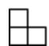
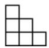
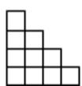
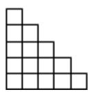
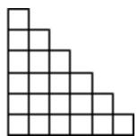

<!-- question-source:start -->
9.【填空题】观察下列图形中小正方形的个数，则第10个图中小正方形的个数为\_\_\_\_。

<!-- question-source:end -->

![[高中/课堂同步/智慧中小学/选择性必修第二册/第四章 数列/4.2.2 等差数列的前n项和公式/等差数列的前n项和公式_2_/二_填空题/习题/answers/Q00051945A1.md]]
