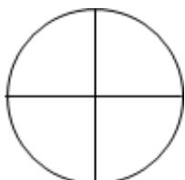

<!-- question-source:start -->
4.【复合题】把圆分成 $n(n \geqslant 3)$

个扇形，设用4种颜色给这些扇形染色，每个扇形恰染一种颜色，并且要求相邻扇形的颜色互不相同，设共有 $f(n)$ 种方法.

(1)【问答题】写出 $f
(3)$ ， $f
(4)$ 的值；

(2)【问答题】猜想 $f(n)(n \geqslant 3)$ ，并用数学归纳法证明.

<!-- question-source:end -->

![[高中/课堂同步/智慧中小学/选择性必修第二册/第四章 数列/4.4 数学归纳法/数学归纳法_2_/二_复合题/习题/answers/Q00052002A1.md]]
