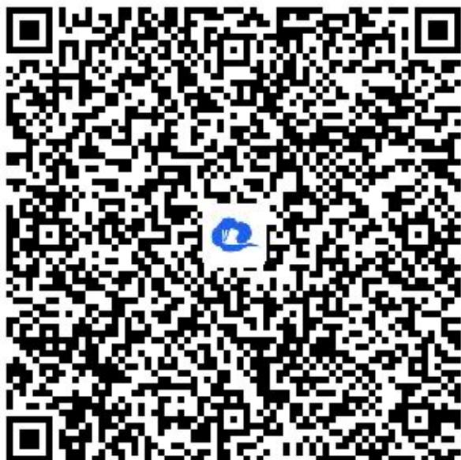

> [!faq]- 《数学归纳法（2）》答案与解析
>
> > [!success]- **【答案】** (1)
>
> > [!note]- **【解析】**
> > $\cos A = \frac{AB^2 + AC^2 - BC^2}{2AB\cdot AC}$ 是有理数.
> >
> > (2)【问答题】用数学归纳法证明 $\cos nA$ 和 $\sin A \cdot \sin nA$ 都是有理数.
> > - **①**：当n=1时，由
> > (1)知 $\cos nA$ 是有理数，
> >
> > 从而有 $\sin A\cdot\sin nA=1-\cos2A$ 也是有理数.
> > - **②**：假设当 $n=k(k\geq1)$ 时，
> >
> > coskA 和 sinA·sinkA都是有理数.
> >
> > 当 $n=k+1$ 时，
> >
> > 由 $\cos(k+1)A=\cos A\cdot\cos kA-\sin A\cdot\sin kA,$
> >
> > $$
> > \sin A \cdot \sin (k + 1) A = \sin A \cdot (\sin A \cdot \cos k A + \cos A \cdot \sin k A) = (\sin A \cdot \sin A) \cdot \cos k A + (\sin A \cdot \sin k A) \cdot \cos A
> > $$
> >
> > 由①和归纳假设，知 $\cos(k+1)A$ 和 $\sin A\cdot\sin(k+1)A$ 都是有理数.
> >
> > 即当 $n=k+l$ 时，结论成立.
> >
> > 综合①、②可知，对任意 n，cosnA 和 sinA·sinnA 都是有理数.
> >
> > 【提示】
> >
> > (1)【问答题】解析视频请查看最后一题。
> >
> > 【更多习题信息】
> >
> > 难易度：适中
> >
> > 知识点：数学归纳法运用，三角函数
> >
> > 【智慧中小学APP扫码查看完整解析】
> >
> > 
