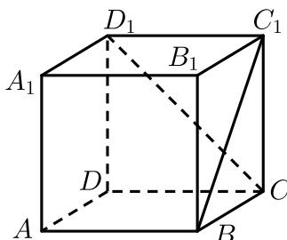

<!-- question-source:start -->
2. 如图，在正方体 $ABCD - A_{1}B_{1}C_{1}D_{1}$ 中，直线 $C_{1}B$ 与 $D_{1}C$ 所成角为（）.

$$
3 0 ^ {\circ}
$$

$$
4 5 ^ {\circ}
$$

$$
6 0 ^ {\circ}
$$

$$
9 0 ^ {\circ}
$$
<!-- question-source:end -->

![[Q00091501A1]]
