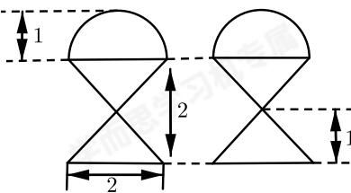
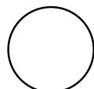

<!-- question-source:start -->
8. 某几何体的三视图如图所示，则该几何体的表面积为（）.

  
正视图  
侧视图

  
俯视图

A. $(3 + 2\sqrt{2})\pi$ B. $(4 + 4\sqrt{2})\pi$ C. $(3 + 4\sqrt{2})\pi$ D. $(4 + 2\sqrt{2})\pi$
<!-- question-source:end -->

![[Q00091507A1]]
