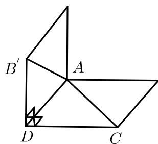

<!-- question-source:start -->
12. 正三角形 $ABC$ 中, 点 $D$ 为 $BC$ 的中点, 把 $\triangle ABD$ 沿 $AD$ 折起, 点 $B$ 的对应点为 $B'$ , 当三棱锥 $B' - ADC$ 体积的最大值为 $\frac{\sqrt{3}}{6}$ 时, 三棱锥 $B' - ADC$ 的外接球的体积为 ( ) .

A. $\frac{3\sqrt{3}}{4}\pi$ B. $\frac{3}{4}\pi$ C. $\frac{5}{6}\pi$ D. $\frac{5\sqrt{5}}{6}\pi$
<!-- question-source:end -->

![[Q00091511A1]]
