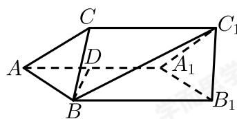

<!-- question-source:start -->
21. 如图，在三棱柱 $ABC-A_{1}B_{1}C_{1}$ 中， $AB=AC=AA_{1}$ ，平面 $AA_{1}C_{1}C \perp$ 平面 $AA_{1}B_{1}B$ ， $\angle CAA_{1}=\angle BAA_{1}=60^{\circ}$ ，点D是 $AA_{1}$ 的中点.

(1) 求证: $BD \perp$ 平面 $AA_{1}C_{1}C$ .

（2）求直线 $BC_{1}$ 与平面 $AA_{1}C_{1}C$ 所成角的正弦值.
<!-- question-source:end -->

![[Q00091520A1]]
