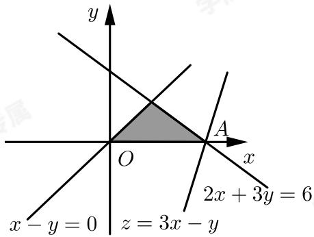

> [!faq]- 2017-2018学年内蒙古包头高一下学期期末数学试卷解析
>
> > [!success]- **【答案】** A
>
> > [!note]- **【解析】**
> > 由约束条件 $\left\{ \begin{array}{l} 2x + 3y \leqslant 6 \\ x - y \geqslant 0 \\ y \geqslant 0 \end{array} \right.$ 作出可行域如图：
> >
> > 
> >
> > 化目标函数 $z = 3x - y$ 为 $y = 3x - z$
> >
> > 由图可知，当直线 $y = 3x - z$ 过点 $A(3,0)$ 时，直线在 $y$ 轴上的截距最小， $z$ 有最大值为9．故选A.
