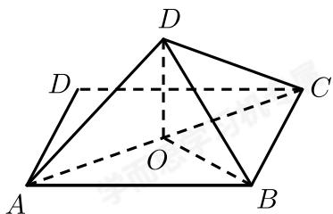

> [!faq]- 2017-2018学年内蒙古包头高一下学期期末数学试卷解析
>
> > [!success]- **【答案】** D
>
> > [!note]- **【解析】**
> > 如图，
> >
> > 
> >
> > 连接 $AC$ ，BD交于O，则 $DO \perp AC$ ， $BO \perp AC$ ， $\therefore \angle BOD$ 为二面角 $B - AC - D$ 的平面角，
> >
> > ∵正方形ABCD的边长为a，则 $BO = DO = \frac{\sqrt{2}}{2} a$
> >
> > 在 $\triangle BOD$ 中，由 $BO = DO = \frac{\sqrt{2}}{2}a$ ， $BD = a$ ，可得 $BO^{2} + OD^{2} = BD^{2}$ ，则 $\angle BOD = 90^{\circ}$ ， $\therefore$ 二面角 $B - AC - D$ 的大小为 $90^{\circ}$ 。
> >
> > 故选：D.
