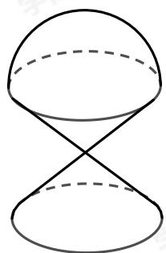

> [!faq]- 2017-2018学年内蒙古包头高一下学期期末数学试卷解析
>
> > [!success]- **【答案】** A
>
> > [!note]- **【解析】**
> > 
> >
> > 由题意可知几何体是上部为半球，下部是两个圆锥的组合体，球的半径为1，圆锥的底面半径为1，高为1，所以几何体的表面积为：
> >
> > $$
> > 2 \pi \times 1 ^ {2} + 2 \times \frac {1}{2} \times 2 \pi \times \sqrt {2} + \pi \times 1 ^ {2} = (3 + 2 \sqrt {2}) \pi .
> > $$
> >
> > 故选：A.
