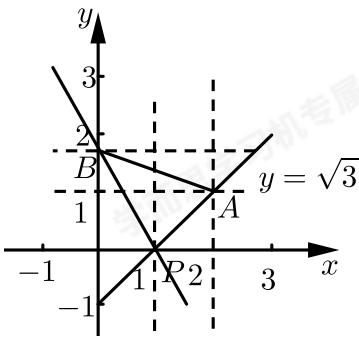

> [!faq]- 2017-2018学年内蒙古包头高一下学期期末数学试卷解析
>
> > [!success]- **【答案】** B
>
> > [!note]- **【解析】**
> > 如图所示：
> >
> > 
> >
> > 当直线 $l$ 过 $B$ 时设直线 $l$ 的斜率为 $k_{1}$
> >
> > 则 $k_{1}=\frac{\sqrt{3}-0}{0-1}=-\sqrt{3},$
> >
> > 当直线l过A时设直线l的斜率为 $k_{2}$ ，
> >
> > 则 $k_{2}=\frac{1-0}{2-1}=1,$
> >
> > ∴要使直线l的斜率的取值范围是 $(-∞,-\sqrt{3}]\cup[1,+∞)$ .
> > 故选B.
