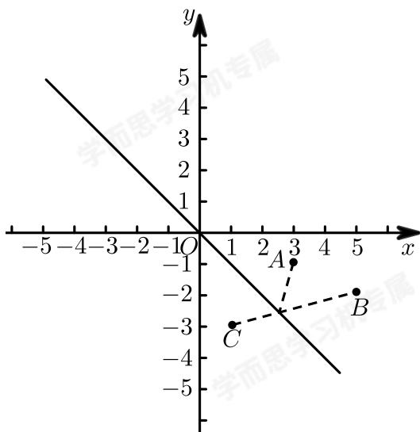

> [!faq]- 2017-2018学年内蒙古包头高一下学期期末数学试卷解析
>
> > [!success]- **【答案】** C
>
> > [!note]- **【解析】**
> > 如下图所示：
> >
> > 
> >
> > 点 $A(3,-1)$ ，关于直线l:x+y=0的对称点为 $C(1,-3)$ 点，
> > 由BC的方程为： $\frac{x-1}{4}=\frac{y+3}{1}$ ，即x-4y-13=0，
> > 可得直线BC与直线l的交点坐标为： $\left(\frac{13}{5},-\frac{13}{5}\right)$ ,
> > 即P点坐标为： $\left(\frac{13}{5},-\frac{13}{5}\right)$ 时， $|PA|+|PB|$ 最小.
> > 故选C.
