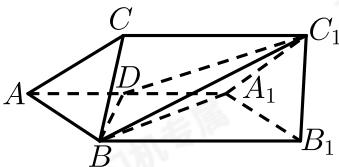
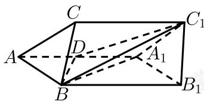

> [!faq]- 2017-2018学年内蒙古包头高一下学期期末数学试卷解析
>
> > [!success]- **【答案】** 详见解析 (2) 正弦值为 $\frac{\sqrt{30}}{10}$
>
> > [!note]- **【解析】**
> > （1）连接 $A_{1}B$
> >
> > 
> >
> > $\because AB = A_{1}A, \angle BAA_{1} = 60^{\circ},$
> >
> > $\therefore \triangle BAA_{1}$ 为正三角形，
> >
> > ∵D是 $AA_{1}$ 的中点，
> >
> > $\therefore BD \perp AA_{1}$ ,
> >
> > 又∵平面 $AA_{1}C_{1}C$ ⊥平面 $AA_{1}B_{1}B$ ,
> >
> > 且平面 $AA_{1}C_{1}C\cap$ 平面 $AA_{1}B_{1}B=AA_{1}$ ， $BD\subset$ 平面 $AA_{1}B_{1}B$ ， $\therefore BD\perp$ 平面 $AA_{1}C_{1}C$ .
> >
> > (2) 连接 $DC_{1}$ :
> >
> > 
> >
> > (1) 中已证 $BD \perp$ 平面 $AA_{1}C_{1}C$ ,
> >
> > $\therefore \angle B C_{1} D$ 为直线 $B C_{1}$ 与平面 $A A_{1} C_{1} C$ 所成的角，
> >
> > 设 $AB = 2a$ ，则正三角形 $\triangle BAA_{1}$ 中， $BD = \sqrt{3} a,$
> >
> > $\triangle A_{1}DC_{1}$ 中， $A_{1}D = a$ ， $A_{1}C_{1} = 2a$ ， $\angle DA_{1}C_{1} = 120^{\circ}$
> >
> > $$
> > \therefore D C _ {1} ^ {2} = a ^ {2} + (2 a) ^ {2} - 2 \times a \times 2 a \times \cos 1 2 0 ^ {\circ} = 7 a ^ {2}
> > $$
> >
> > $$
> > \therefore D C _ {1} = \sqrt {7} a,
> > $$
> >
> > $\therefore \mathrm{Rt}\triangle BDC_{1}$ 中， $BC_{1} = \sqrt{3a^{2} + 7a^{2}} = \sqrt{10} a,$
> >
> > $$
> > \therefore \sin \angle B C _ {1} D = \frac {B D}{B C _ {1}} = \frac {\sqrt {3} a}{\sqrt {1 0} a} = \frac {\sqrt {3 0}}{1 0},
> > $$
> >
> > 即直线 $BC_{1}$ 与平面 $AA_{1}C_{1}C$ 所成角的正弦值为 $\frac{\sqrt{30}}{10}$ .
