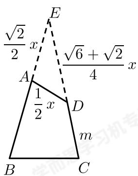

> [!faq]- 2018-2019学年内蒙古包头昆都仑区包头市第九中学高一下学期期中数学试卷解析
>
> > [!success]- **【答案】** D
>
> > [!note]- **【解析】**
> > 如图所示，延长BA，CD交于点E，则：
> >
> > 
> >
> > 在 $\triangle ADE$ 中， $\angle DAE=105^{\circ}$ ， $\angle ADE=45^{\circ}$ ， $\angle E=30^{\circ}$ ，
> >
> > $$
> > A D = \frac {1}{2} x, A E = \frac {\sqrt {2}}{2} x, D E = \frac {\sqrt {6} + \sqrt {2}}{4} x, C D = m
> > $$
> >
> > 结合 $BC = 2$ 可得： $\left(\frac{\sqrt{6} + \sqrt{2}}{4} x + m\right)\sin 15^{\circ} = 1,$
> >
> > $$
> > \therefore \frac {\sqrt {6} + \sqrt {2}}{4} x + m = \sqrt {6} + \sqrt {2},
> > $$
> >
> > $$
> > A B = \frac {\sqrt {6} + \sqrt {2}}{4} x + m - \frac {\sqrt {2}}{2} x = \sqrt {6} + \sqrt {2} - \frac {\sqrt {2}}{2} x,
> > $$
> >
> > 故 $AB$ 的取值范围是 $(\sqrt{6} - \sqrt{2}, \sqrt{6} + \sqrt{2})$ .
> >
> > 故选D.
