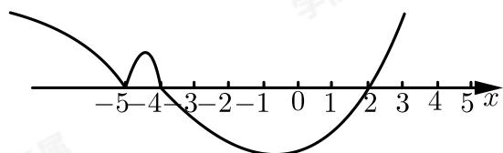

> [!faq]- 2018-2019学年内蒙古包头昆都仑区包头市第九中学高一下学期期中数学试卷解析
>
> > [!success]- **【答案】** 详见解析 (2) $(- \infty, -5) \cup (-5, -4) \cup (2, +\infty)$
>
> > [!note]- **【解析】**
> > （1）由题意，可将不等式化为同解不等式：
> >
> > $\frac{3x+1}{3-x}>-1\Leftrightarrow\frac{3x+1}{3-x}+1>0\Leftrightarrow\frac{2x+4}{3-x}>0\Leftrightarrow\frac{x+2}{x-3}<0$ $\Leftrightarrow(x+2)(x-3)<0,$ 解得：-2<x<3，
> > ∴原不等式解集为： $\{x\mid-2<x<3\}$ .
> >
> > (2) 由题意，可知：
> >
> > $$
> > (x + 4) (x + 5) ^ {2} (x - 2) ^ {5} > 0,
> > $$
> >
> > 画图如下：
> >
> > 
> >
> > ∴原不等式解集为： $(-∞,-5)∪(-5,-4)∪(2,+∞)$ .
