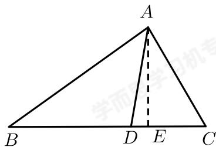
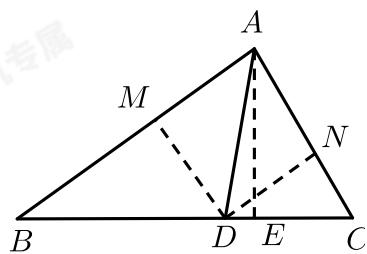

> [!faq]- 2018-2019学年内蒙古包头昆都仑区包头市第九中学高一下学期期中数学试卷解析
>
> > [!success]- **【答案】** 详见解析
>
> > [!note]- **【解析】**
> > 详见解析
> >
> > （1）如图，过 A 作 AE ⊥ BC 于 E， $\because \frac{S_{\triangle ABD}}{S_{\triangle ADC}} = \frac{\frac{1}{2} BD \times AE}{\frac{1}{2} DC \times AE} = 2,$ $\therefore BD = 2DC,$ $\because AD$ 平分 $\angle BAC,$ $\therefore \angle BAD = \angle DAC,$ 在 $\triangle ABD$ 中， $\frac{BD}{\sin \angle BAD} = \frac{AD}{\sin B}, \therefore \sin B = \frac{AD \times \sin \angle BAD}{BD},$ 在 $\triangle ADC$ 中， $\frac{DC}{\sin \angle DAC} = \frac{AD}{\sin C}, \therefore \sin C = \frac{AD \times \sin \angle DAC}{DC};$ $\therefore \frac{\sin B}{\sin C} = \frac{DC}{BD} = \frac{1}{2}.$
> >
> > 
> >
> > (2) 由（1）知， $BD = 2DC = 2 \times \frac{\sqrt{2}}{2} = \sqrt{2}$ .
> > 过D作DM⊥AB于M，作DN⊥AC于N，
> > ∵AD平分∠BAC，
> > ∴DM = DN,
> > ∴ $\frac{S_{\triangle ABD}}{S_{\triangle ADC}}=\frac{\frac{1}{2}AB\times DM}{\frac{1}{2}AC\times DN}=2,$ ∴AB=2AC,
> > 令AC=x，则AB=2x,
> > ∵∠BAD=∠DAC,
> > ∴cos∠BAD=cos∠DAC,
> > ∴由余弦定理可得: $\frac{(2x)^{2}+1^{2}-(\sqrt{2})^{2}}{2\times2x\times1}=\frac{x^{2}+1^{2}-\left(\frac{\sqrt{2}}{2}\right)^{2}}{2\times x\times1}$ ∴x=1,
> > ∴AC=1,
> > ∴BD的长为 $\sqrt{2}$ ，AC的长为1.
> >
> > 
