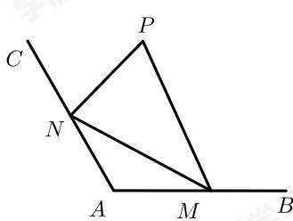

<!-- question-source:start -->
21. 如图, 某湖泊湿地为拓展旅游业务, 现准备在湿地内建造一个观景台 $P$ , 已知射线 $AB$ , $AC$ 为湿地两边夹角为 $120^{\circ}$ 的公路 (长度均超过2千米), 在两条公路 $AB$ , $AC$ 上分别设立游客接送点 $M$ , $N$ , 从观景台 $P$ 到 $M$ , $N$ 建造两条观光线路 $PM$ , $PN$ , 测得 $AM = 2$ 千米, $AN = 2$ 千米.

(1) 求线段MN的长度.

（2）若 $\angle MPN = 60^{\circ}$ ，求两条观光线路 $PM$ 与 $PN$ 之和的最大值.
<!-- question-source:end -->

![[Q00092703A1]]
