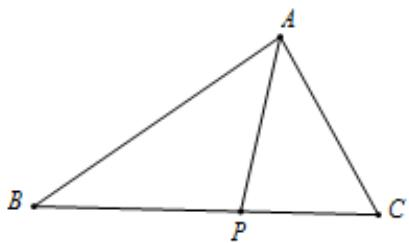

<!-- question-source:start -->
20. 如图，在 $\triangle ABC$ 中，点 $P$ 在 $BC$ 边上， $\angle PAC = 60^{\circ}$ ， $PC = 2$ ， $AP + AC = 4$

(1) 求边 $AC$ 的长;

(2) 若 $\triangle APB$ 的面积是 $2\sqrt{3}$ , 求 $\sin \angle BAP$ 的值.
<!-- question-source:end -->

![[Q00092693A1]]
