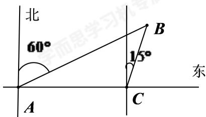

> [!faq]- 2020-2021学年4月内蒙古包头青山区包头市第四中学高一下学期月考数学试卷解析
>
> > [!success]- **【答案】** $30\sqrt{2}km$
>
> > [!note]- **【解析】**
> > 解：通过题意画出示意图，如图：
> >
> > 
> >
> > 可得 $\angle CAB=30^{\circ}$ ， $\angle BCA=105^{\circ}$ ， $AC=60$ ，
> >
> > 则 $\angle B = 180^{\circ} - 30^{\circ} - 105^{\circ} = 45^{\circ}$
> >
> > 在 $\triangle ABC$ 中，由正弦定理得 $\frac{BC}{\sin\angle CAB} = \frac{AC}{\sin B}$ ，即 $\frac{CB}{\frac{1}{2}} = \frac{60}{\frac{\sqrt{2}}{2}}$
> >
> > 解得 $CB = 30\sqrt{2}$
> >
> > 因此正确答案为： $30\sqrt{2}km$ .
