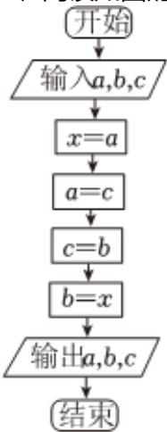

<!-- question-source:start -->
3、在用最小二乘法进行线性回归分析时，有下列说法：

$$
\left(x _ {1}, y _ {1}\right), \left(x _ {2}, y _ {2}\right), \dots , \left(x _ {n}, y _ {n}\right)
$$

②残差图中的残差点比较均匀地落在水平的带状区域中，宽度越窄，则说明模型拟合精度越高；

③利用 $R^2 = 1 - \frac{\sum_{i=1}^{n}(y_i - \hat{y}_i)^2}{\sum_{i=1}^{n}(y_i - \overline{y})^2}$ 来刻画回归的效果， $R^2 \approx 0.75$ 比 $R^2 \approx 0.64$ 的模型回归效果好。以上说法正确的（）A ①②B ①③

C ①②③
D ②③

<!-- question-source:end -->

![[Q00090230A1]]
