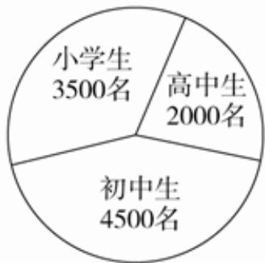
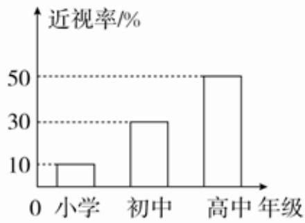

<!-- question-source:start -->
5、已知某地区中小学生人数和近视情况分别如图1和图2所示，为了解该地区中小学生的近视形成原因，用分层抽样的方法抽取 $4\%$ 的学生进行调查，则样本容量和抽取的高中生近视人数分别为（）

  
图1

  
图2

A 200, 20
B 400, 40
C 200, 40
D 400, 20
<!-- question-source:end -->

![[Q00090232A1]]
