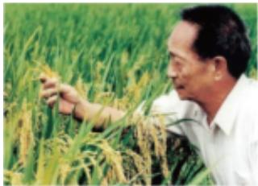
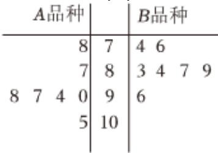

<!-- question-source:start -->
6、2012年，在“杂交水稻之父”袁隆平的实验田内种植了A，B两个品种的水稻，为了筛选出更优的品种，在A，B两个品种的实验田中分别抽取7块实验田，如图所示的茎叶图记录了这14块实验田的亩产量（单位：

10kg)，通过茎叶图比较两个品种的均值及方差，并从中挑选一个品种进行以后的推广，有如下结论：①A品种水稻的平均产量高于B品种水稻，推广A品种水稻；②B品种水稻的平均产量高于A品种水稻，推广B品种水稻；③A品种水稻比B品种水稻产量更稳定，推广A品种水稻；④B品种水稻比A品种水稻产量更稳定，推广B品种水稻；其中正确结论的编号为（）

A ①②
B ①③
C ②④
D ①④
<!-- question-source:end -->

![[Q00090233A1]]
