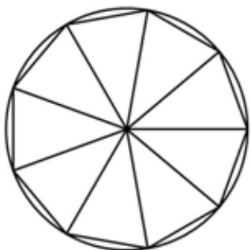

<!-- question-source:start -->
9、在区间 $\left[-\frac{\pi}{4}, \frac{\pi}{4}\right]$ 上随机取一个数 $x$ ，则 $\cos x$ 的值介于 $\frac{\sqrt{3}}{2}$ 到 1 的概率为（）
A $\frac{1}{3}$ B $\frac{1}{2}$ C $\frac{2}{3}$ D $\frac{3}{4}$

<!-- question-source:end -->

![[Q00090236A1]]
