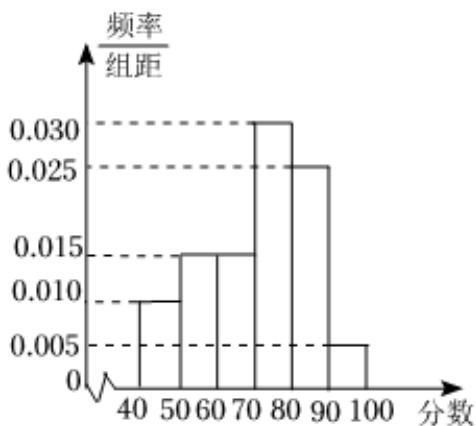

<!-- question-source:start -->
11、如图，是根据某班学生在一次数学考试中的成绩画出的频率分布直方图，若由直方图得到的众数，中位数和平均数（同一组中的数据用该组区间的中点值为代表）分别为 $a, b, c$ ，则（）
A $b > a > c$ B $a > b > c$

C $\frac{a + c}{2} >b$ D $\frac{b + c}{2} >a$
<!-- question-source:end -->

![[Q00090238A1]]
