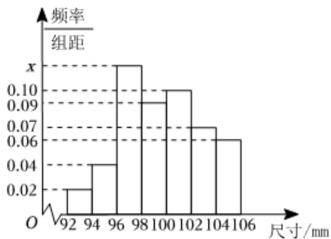

<!-- question-source:start -->
1、

为了了解某工厂生产的产品情况，从工厂一个月生产的产品中随机抽取了一个容量为200的样本，测最它们的尺寸（单位：mm），将数据分为[92, 94)，[94, 96)，[96, 98)，[98, 100)，[100, 102)，[102, 104)，[104, 106)七组，其频率分布直方图如图所示.

## 1 求频率分布直方图中x的值；

2

记产品尺寸在[98,102)内为A等品，每件可获利6元；产品尺寸在[92,94)内为不合格品，每件亏损3元；其余的为合格品，每件可获利4元，若该工厂一个月共生产2000件产品，以样本的频率代替总体在各组的频率，求该工厂生产的产品一个月所获得的利润.
<!-- question-source:end -->

![[Q00092119A1]]
