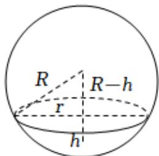

> [!faq]- 2020-2021学年内蒙古包头四中高二（下）月考数学试卷（文科）（4月份）解析
>
> > [!success]- **【答案】** $\frac{h^2 + r^2}{2h}$
>
> > [!note]- **【解析】**
> > 如下图所示：
> >
> > 球心到截面圆的距离为 $R - h$ ，由勾股定理可得 $(R - h)^2 + r^2 = R^2$
> >
> > 化简得 $r^{2}+h^{2}=2Rh$ ，解得 $R=\frac{r^{2}+h^{2}}{2h}$ .
> >
> > 
> >
> > 故答案为： $\frac{h^2 + r^2}{2h}$
