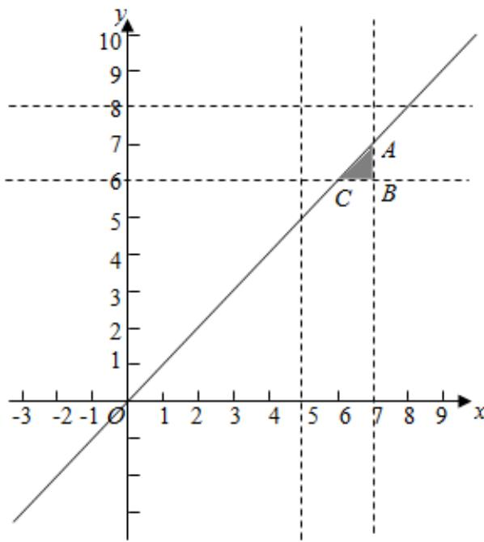

> [!faq]- 2020-2021学年内蒙古包头四中高二（下）月考数学试卷（文科）（4月份）解析
>
> > [!success]- **【答案】** $\frac{1}{8}$
>
> > [!note]- **【解析】**
> > 设两个人解答一道几何题所用的时间为分别为 $x, y$ ，则 $5 < x < 7, 6 < y < 8$ ，对应区域的面积为4，甲、乙各解同一道几何题，则乙比甲先解答完的满足 $x > y$ ，对应区域面积
> >
> > $\frac{1}{2} \times 1 \times 1 = \frac{1}{2}$ ，由几何概型的个数得到所求概率为 $\frac{1}{8}$ ；故答案为： $\frac{1}{8}$ .
> >
> > 
